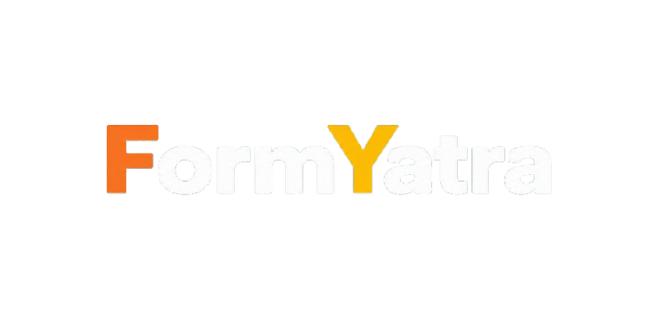

# FormYatra

A powerful, dynamic form builder built as a monorepo with modern tech stack. 



## Features

- **Dynamic Form Builder**: Drag and drop fields, create multi-page flows.
- **Pre-made Templates**: Start from a curated set of schema templates.
- **Analytics Dashboard**: Real-time response graphs (pie charts, line charts) using Recharts.
- **Data Export**: One-click export to CSV.
- **QR Code Sharing**: Instantly generate and download form QR codes.
- **Theming System**: Beautiful India-inspired palettes (Mumbai, Jaipur, Goa, Kerala, Bangalore).
- **Public & Unlisted Forms**: Control visibility with granular status logic.
- **Response Limits**: Enforce maximum submissions and expiry dates on forms.

## Tech Stack

- **Framework**: Next.js 14, React 19
- **Monorepo**: Turborepo, pnpm
- **Backend APIs**: tRPC, Scalar OpenAPI documentation
- **Database**: PostgreSQL (via local Docker compose), Drizzle ORM
- **Styling**: Tailwind CSS v4, custom theme tokens
- **Validation**: Zod
- **Components**: Radix UI
- **Charts**: Recharts

## Getting Started

### 1. Install Dependencies
```bash
pnpm install
```

### 2. Setup Environment Variables
Ensure the following `.env` files exist with standard development variables:
- `apps/web/.env`
- `apps/api/.env`
- `packages/database/.env`
- `packages/trpc/.env`
- `packages/services/.env`

*(A setup script `setup.sh` is provided in the root to auto-generate development `.env` files).*

### 3. Start PostgreSQL
```bash
docker-compose up -d
```

### 4. Database Setup
```bash
pnpm db:generate
pnpm db:migrate
pnpm db:seed
```

### 5. Run the Application
```bash
pnpm run dev
```

### Endpoints
- **Web App**: http://localhost:3000
- **API (Scalar Docs)**: http://localhost:8000/docs

## Demo Credentials
You can log in with:
- **Email**: `admin@formyatra.com`
- **Password**: `password123`

*(Populated automatically if you ran `pnpm db:seed`)*

## Repository Structure
- `apps/web`: Frontend application (Next.js)
- `apps/api`: Backend application hosting tRPC routes and Scalar OpenAPI docs
- `packages/database`: Drizzle ORM schemas and DB connection setup
- `packages/services`: Business logic layer (Auth, Forms, Submissions)
- `packages/trpc`: tRPC routers, context, and models
- `packages/ui`: Shared UI components
